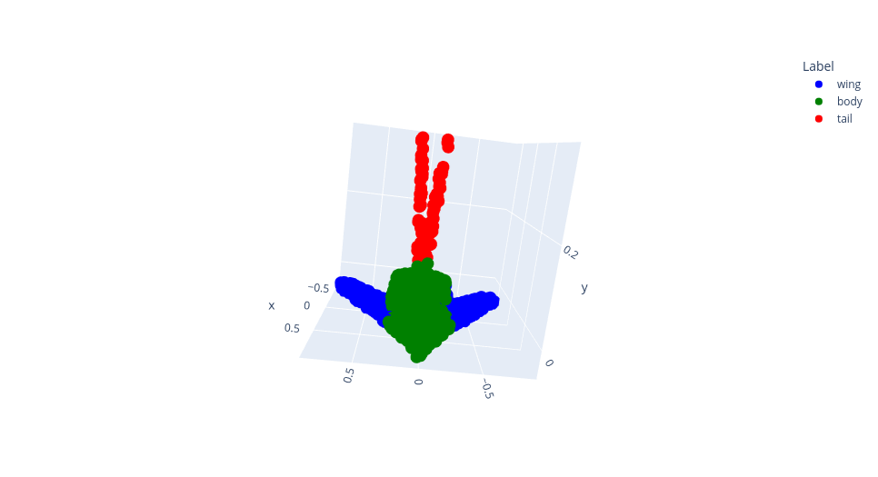
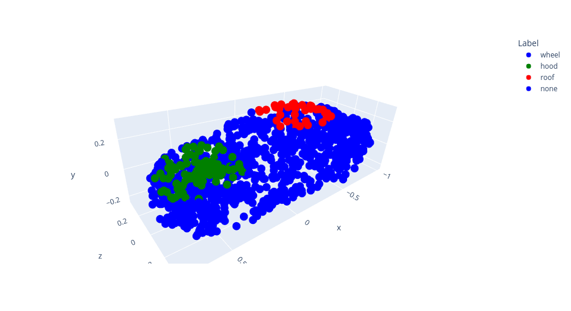
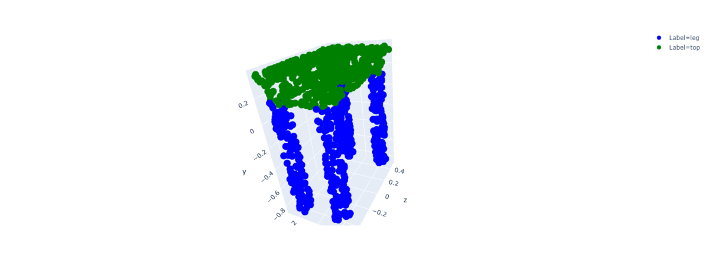

# Point Cloud Segmentation

_**By [Soumik Rakshit](https://github.com/soumik12345) & [Sayak Paul](https://github.com/sayakpaul)**_


This repository provides a TF2 implementation of PointNet<sup>1</sup> for segmenting point clouds. Our implementation is fully supported on
TPUs allowing you to train models faster. Distributed training (single-device multi-worker) on GPUs is also supported and so is single-GPU
training. Pre-trained models and results will be made available very soon. 

To get an understanding of PointNet for segmentation, follow this blog post from keras.io: [Point cloud segmentation with PointNet](https://keras.io/examples/vision/pointnet_segmentation/).

## Running using Docker

- Build image using `docker build -t point-cloud-image .`

- Run Jupyter Server using `docker run -it --gpus all -p 8888:8888 -v $(pwd):/usr/src/point-cloud-segmentation point-cloud-image`


## Create TFRecords for ShapenetCore Shape Segmentation

This part is only required if you would like to train models using TPUs. Be advised that
training using TPUs is usually recommended when you have sufficient amount of data. Therefore, 
you should only use TPUs for the following object categories:

* `Airplane`
* `Car`
* `Chair`

```
Usage: create_tfrecords.py [OPTIONS]

Example:
  python create_tfrecords.py --experiment_configs configs/shapenetcore.py
```


## Train for ShapenetCore Shape Segmentation

```
Usage: train_shapenet_core.py [OPTIONS]

Options:
  --experiment_configs    Experiment configs (configs/shapenetcore.py)
  --wandb_project_name    Project Name (DEFAULT: pointnet_shapenet_core)
  --use_wandb             Use WandB flag (DEFAULT: True)

Example:
  python train_shapenet_core.py --experiment_configs configs/shapenetcore.py
```

In case you want to change the configuration-related parameters, either edit them directly in
`configs/shapenetcore.py` or add a new configuration and specify the name of the configuration
in the command line.

## Segmentation Results

### Airplane



### Car



### Chair


### Table



## Additional notes

* The `batch_size` here denotes local batch size. If you are using single-host multi-worker distributed training,
the `batch_size` denoted here will be multiplied by the number of workers you have. 
* Using a Google Cloud Storage (GCS) based `artifact_location` is not a requirement if you are using GPU(s). But for 
TPUs, it's a requirement. 

## References

[1] PointNet: Deep Learning on Point Sets for 3D Classification and Segmentation; Charles R. Qi, Hao Su, Kaichun Mo, Leonidas J. Guibas;
CVPR 2017; https://arxiv.org/abs/1612.00593.

## Acknowledgements

We are thankful to the [GDE program](https://developers.google.com/programs/experts/) for providing us GCP credits.
